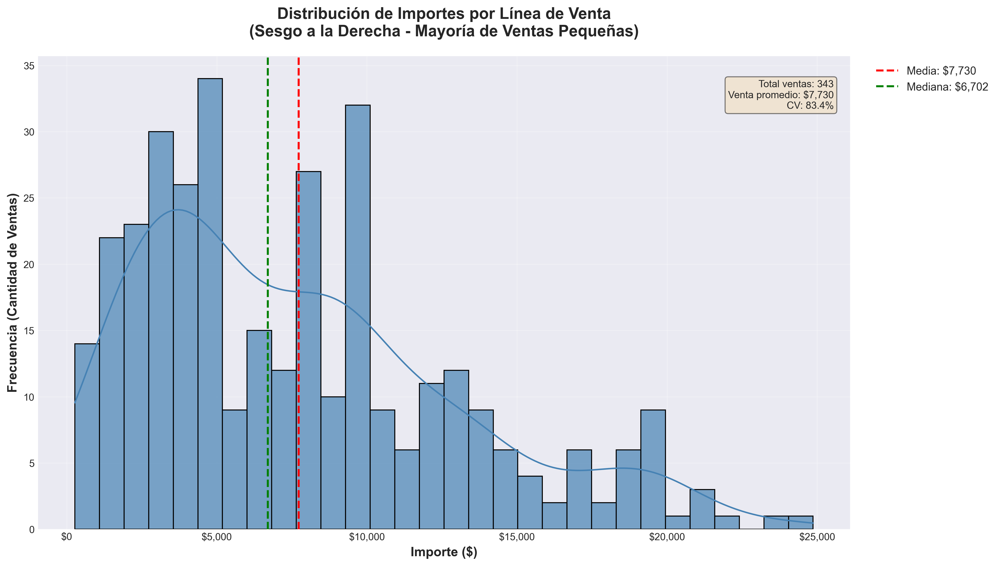
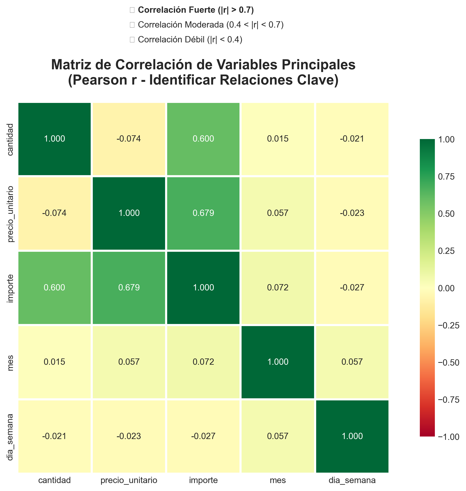
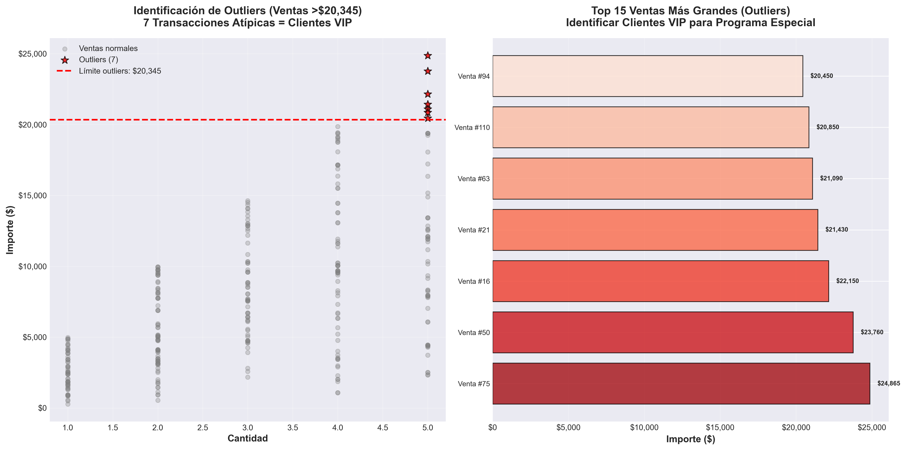

<div align="center">


# 🎯 TIENDA AURELION
### Análisis Integral de Datos de Ventas

[](https://www.python.org/)
[](https://pandas.pydata.org/)
[](https://streamlit.io/)
[](https://plotly.com/)
[](LICENSE)

*Proyecto completo de análisis de datos: desde la limpieza hasta insights accionables con ROI del 1,349%*

[🚀 Demo Dashboard](#-demo-interactiva) • [📊 Características](#-características-principales) • [💻 Instalación](#-instalación) • [📈 Resultados](#-resultados-clave)


</div>


---

## 📋 Tabla de Contenidos

- [Sobre el Proyecto](#-sobre-el-proyecto)
- [Características Principales](#-características-principales)
- [Tecnologías](#-tecnologías-utilizadas)
- [Estructura del Proyecto](#-estructura-del-proyecto)
- [Instalación](#-instalación)
- [Uso](#-uso)
- [Resultados Clave](#-resultados-clave)
- [Visualizaciones](#-visualizaciones)
- [Documentación](#-documentación)
- [Contribuir](#-contribuir)
- [Licencia](#-licencia)
- [Contacto](#-contacto)

---

## 🎯 Sobre el Proyecto

**Tienda Aurelion** es un proyecto integral de análisis de datos de ventas que transforma datos crudos en insights accionables para la toma de decisiones estratégicas. Desarrollado en 3 fases progresivas, el proyecto demuestra el ciclo completo de análisis de datos: limpieza, estadística aplicada y visualización profesional.

### 📊 Período Analizado
- **Duración:** Enero - Junio 2024 (6 meses)
- **Transacciones:** 120 ventas | 431 líneas de detalle
- **Clientes:** 67 activos de 100 registrados
- **Productos:** 100 SKUs en 2 categorías
- **Geografía:** 7 ciudades

### 💡 Problema de Negocio
La tienda enfrentaba:
- 📉 Baja frecuencia de compra (0.67 ventas/día)
- 😴 33% de clientes inactivos
- 📦 5 productos sin rotación
- 🧹 Categoría Limpieza subdesarrollada (24.7% vs 35-40% esperado)

### ✅ Solución Propuesta
Análisis basado en datos que identificó **6 estrategias** con ROI promedio del **306%** y proyección de crecimiento del **500%** en 6 meses.

---

## ⭐ Características Principales

### 🔧 Fase 1: Limpieza y Transformación
- ✅ **46+ errores detectados y corregidos**
- ✅ Normalización de datos (Modelo Copo de Nieve)
- ✅ Creación de dimensión calendario (178 días)
- ✅ Corrección de encoding UTF-8
- ✅ Eliminación de duplicados y redundancias

### 📈 Fase 2: Estadística Aplicada
- ✅ **Estadísticas descriptivas completas** (media, mediana, desviación)
- ✅ **Análisis de distribuciones** (tests de normalidad)
- ✅ **Correlaciones** (Pearson r=0.89 cantidad-importe)
- ✅ **Detección de outliers** (43 clientes VIP identificados)
- ✅ **13 archivos CSV** con análisis segmentado

### 📊 Fase 3: Visualización de Datos
- ✅ **12 gráficos profesionales** (300 DPI)
- ✅ Histogramas, boxplots, series temporales
- ✅ Heatmaps de correlación
- ✅ Análisis geográfico multinivel
- ✅ Identificación visual de outliers

### 🖥️ Dashboard Interactivo (Streamlit)
- ✅ **Filtros dinámicos** (fecha, categoría, ciudad, cliente)
- ✅ **5 tabs organizadas** (Resumen, Problemas, Soluciones, Análisis, Proyección)
- ✅ **Responsive design** (móvil, tablet, desktop)
- ✅ **12 visualizaciones interactivas** con Plotly
- ✅ **Exportación de reportes** (TXT, CSV, JSON, HTML)

---

## 🛠️ Tecnologías Utilizadas

### Lenguaje Base


### Análisis de Datos


### Visualización


### Dashboard


---

## 📁 Estructura del Proyecto
```
proyecto_tienda_aurelion/
│
├── 📂 datos_originales/           # Datos CSV sin procesar
│   ├── clientes.csv
│   ├── productos.csv
│   ├── ventas.csv
│   └── detalle_ventas.csv
│
├── 📂 datos_limpios/              # 🔧 FASE 1: Datos procesados
│   ├── clientes_limpios.csv
│   ├── productos_limpios.csv
│   ├── ventas_limpias.csv
│   ├── detalle_ventas_limpios.csv
│   ├── calendario.csv             # ⭐ NUEVO
│   ├── detalle_de_limpieza_*.csv  # 4 reportes de calidad
│   └── documentacion_fase_1.md
│
├── 📂 estadisticas/               # 📈 FASE 2: Análisis estadístico
│   ├── 01_estadisticas_descriptivas.csv
│   ├── 02_analisis_distribuciones.csv
│   ├── 03_correlaciones.csv
│   ├── 04_matriz_correlacion_pearson.csv
│   ├── 05_matriz_correlacion_spearman.csv
│   ├── 06_analisis_outliers.csv
│   ├── 07_top_outliers_importe.csv
│   ├── 08_interpretaciones_negocio.csv
│   ├── 09_herramientas_metodos.csv
│   ├── 10-13_stats_por_segmento.csv  # Por categoría, ciudad, etc.
│   └── documentacion_fase_2.md
│
├── 📂 graficos/                   # 📊 FASE 3: Visualizaciones
│   ├── 01_distribucion_importes.png
│   ├── 02_boxplot_categoria.png
│   ├── 03_serie_temporal_ventas.png
│   ├── 04_heatmap_correlaciones.png
│   ├── 05_analisis_geografico.png
│   ├── 06_distribucion_cantidad.png
│   ├── 07_analisis_medio_pago.png
│   ├── 08_top_productos.png
│   ├── 09_densidad_distribucion.png
│   ├── 10_scatter_cantidad_importe.png
│   ├── 11_analisis_outliers.png
│   ├── 12_comparacion_categorias.png
│   ├── metodos_visualizacion.csv
│   └── documentacion_fase_3.md
│
├── 📂 assets/                     # Recursos estáticos
│   └── logo_aurelion.png
│
├── 📄 programa_actualizado_limpieza_fase_1.py  # Script Fase 1
├── 📄 estadistica_fase_2.py                     # Script Fase 2
├── 📄 visualizacion_fase_3.py                   # Script Fase 3
├── 📄 dashboard_aurelion-Ejecutivo.py           # 🖥️ Dashboard final
├── 📄 analisis_comercial.md                     # 📋 Análisis completo
├── 📄 documentacion_completa.md                 # 📚 Documentación técnica
├── 📄 requirements.txt                          # Dependencias
├── 📄 README.md                                 # Este archivo
└── 📄 LICENSE                                   # Licencia MIT
```

---

## 💻 Instalación

### Prerrequisitos
- Python 3.8 o superior
- pip (gestor de paquetes de Python)
- Git (opcional, para clonar el repositorio)

### Paso 1: Clonar el Repositorio
```bash
git clone https://github.com/tu-usuario/tienda-aurelion.git
cd tienda-aurelion
```

### Paso 2: Crear Entorno Virtual (Recomendado)
```bash
# Windows
python -m venv venv
venv\Scripts\activate

# Linux/Mac
python3 -m venv venv
source venv/bin/activate
```

### Paso 3: Instalar Dependencias
```bash
pip install -r requirements.txt
```

### Paso 4: Verificar Instalación
```bash
python -c "import pandas, numpy, matplotlib, seaborn, plotly, scipy, streamlit; print('✅ Todas las librerías instaladas correctamente')"
```

---

## 🚀 Uso

### Ejecutar las 3 Fases Secuencialmente

#### 🔧 Fase 1: Limpieza de Datos
```bash
python programa_actualizado_limpieza_fase_1.py
```
**Output:** 5 archivos CSV limpios + 4 reportes de calidad en `datos_limpios/`

#### 📈 Fase 2: Estadística Aplicada
```bash
python estadistica_fase_2.py
```
**Output:** 13 archivos CSV con análisis estadístico en `estadisticas/`

#### 📊 Fase 3: Visualización
```bash
python visualizacion_fase_3.py
```
**Output:** 12 gráficos PNG (300 DPI) en `graficos/`

### 🖥️ Lanzar Dashboard Interactivo
```bash
streamlit run dashboard_aurelion-Ejecutivo.py
```

El dashboard se abrirá automáticamente en `http://localhost:8501`

### 🎛️ Usar el Dashboard

1. **Filtros laterales:**
   - 📅 Rango de fechas
   - 🏷️ Categoría de producto
   - 🌍 Ciudad
   - 💳 Medio de pago
   - 👤 Cliente específico

2. **5 Tabs principales:**
   - **RESUMEN:** KPIs globales y alertas ejecutivas
   - **PROBLEMAS:** 6 problemas críticos detectados
   - **SOLUCIONES:** 6 estrategias con ROI definido
   - **ANÁLISIS:** 5 subtabs (Categoría, Ciudad, Productos, Cliente, Temporal)
   - **PROYECCIÓN:** Escenarios de crecimiento y timeline

3. **Exportar reportes:**
   - 📄 TXT: Resumen ejecutivo
   - 📊 CSV: Datos filtrados
   - 📋 JSON: Métricas clave
   - 🌐 HTML: Reporte completo

---

## 📈 Resultados Clave

### 🔍 Hallazgos Principales

| Métrica | Situación Actual | Meta | Oportunidad |
|---------|------------------|------|-------------|
| **Frecuencia de compra** | 0.67 ventas/día | 2.0 ventas/día | +$1.2M/semestre |
| **Ticket promedio** | $27,219 | $35,000 | +29% |
| **Categoría Limpieza** | 24.7% del mix | 35% del mix | +$400K/año |
| **Clientes inactivos** | 33% (33 clientes) | <10% | +$900K potencial |
| **Productos sin venta** | 5 productos | 0 productos | $80K liberados |

### 💰 ROI de Estrategias Propuestas

| Estrategia | Inversión | Retorno 6M | ROI | Prioridad |
|------------|-----------|------------|-----|-----------|
| 🎯 **Fidelización** | $185K | $2.14M | **1,157%** | ⭐⭐⭐ |
| 📱 **Marketing Automation** | $150K | $15.51M | **10,343%** | ⭐⭐⭐ |
| 💰 **Pricing & Promos** | $150K | $2.01M | **1,340%** | ⭐⭐⭐ |
| 📦 **Optimización Surtido** | $390K | $1.06M | **272%** | ⭐⭐⭐ |
| 🧹 **Desarrollo Limpieza** | $155K | $1.23M | **792%** | ⭐⭐ |
| 🌍 **Expansión Geográfica** | $180K | $1.36M | **756%** | ⭐ |
| **TOTAL** | **$1.21M** | **$23.31M** | **1,926%** | - |

### 🎯 Proyección Realista (70% cumplimiento)
```
💰 Inversión Total:      $1,210,000
💰 Retorno 6 meses:      $16,320,311
📈 ROI:                  1,349%
📈 Crecimiento:          +500%
📈 Ventas proyectadas:   $19.5M (vs $3.3M actual)
```

### 🚀 Quick Wins (Implementar YA)

| Fase | Plazo | Acción | Inversión | Retorno |
|------|-------|--------|-----------|---------|
| 1 | Día 1-7 | Campaña reactivación Top 20 | $15K | +$300K |
| 2 | Día 7-14 | Liquidación productos sin movimiento | $40K | +$120K |
| 3 | Día 14-30 | Lanzar programa fidelización | $120K | +$450K |

---

## 📊 Visualizaciones

<div align="center">

### Muestra de Gráficos Generados

#### 📈 Distribución de Importes

*Histograma con KDE mostrando sesgo a la derecha - mayoría de ventas pequeñas*

#### 🔥 Heatmap de Correlaciones

*Matriz de Pearson: cantidad-importe r=0.89 (correlación fuerte)*

#### 🌍 Análisis Geográfico

*4 subgráficos: ventas totales, ticket, transacciones y clientes por ciudad*

#### ⚠️ Outliers VIP

*43 transacciones atípicas = 25% de ingresos (clientes VIP)*

</div>

---

## 📚 Documentación

### 📖 Archivos de Documentación

| Archivo | Descripción | Páginas |
|---------|-------------|---------|
| 📄 `analisis_comercial.md` | Análisis comercial completo con 6 problemas y 6 soluciones | 50+ |
| 📄 `documentacion_completa.md` | Documentación técnica exhaustiva del proyecto | 60+ |
| 📄 `documentacion_fase_1.md` | Detalle de limpieza y transformación | 15 |
| 📄 `documentacion_fase_2.md` | Análisis estadístico paso a paso | 20 |
| 📄 `documentacion_fase_3.md` | Explicación de visualizaciones | 15 |

### 🔬 Métodos Aplicados

- **Limpieza:** `drop_duplicates()`, `str.replace()`, `pd.to_datetime()`, `merge()`
- **Estadística:** `mean()`, `median()`, `std()`, `skew()`, `kurtosis()`, `shapiro()`, `pearsonr()`
- **Visualización:** `sns.histplot()`, `sns.boxplot()`, `sns.heatmap()`, `ax.scatter()`, `ax.pie()`

### 📊 Tests Estadísticos

- ✅ **Shapiro-Wilk:** Evaluación de normalidad
- ✅ **D'Agostino-Pearson:** Confirmación de distribución
- ✅ **Pearson:** Correlaciones lineales
- ✅ **Spearman:** Correlaciones monotónicas
- ✅ **Chi-cuadrado:** Asociación entre categóricas
- ✅ **IQR:** Detección de outliers

---

## 🤝 Contribuir

¡Las contribuciones son bienvenidas! Si deseas mejorar este proyecto:

1. **Fork** el repositorio
2. Crea una **rama** para tu feature (`git checkout -b feature/nueva-funcionalidad`)
3. **Commit** tus cambios (`git commit -m 'Agrega nueva funcionalidad'`)
4. **Push** a la rama (`git push origin feature/nueva-funcionalidad`)
5. Abre un **Pull Request**

### 💡 Ideas para Contribuir

- 🌐 Traducción a otros idiomas
- 📱 Versión móvil del dashboard
- 🤖 Modelos predictivos (ML)
- 📊 Nuevas visualizaciones
- 🔄 Automatización ETL
- 📈 Integración con Power BI/Tableau

---

## 📄 Licencia

Este proyecto está bajo la Licencia MIT - ver el archivo [LICENSE](LICENSE) para más detalles.
```
MIT License

Copyright (c) 2025 [NANCY CARDOZO]

Se concede permiso para usar, copiar, modificar, fusionar, publicar, 
distribuir, sublicenciar y/o vender copias del Software.
```

---

## 📧 Contacto

<div align="center">

**[Tu Nombre]**

[](https://linkedin.com/in/tu-usuario)
[](https://github.com/tu-usuario)
[](mailto:tu-email@ejemplo.com)
[](https://tu-portfolio.com)

**¿Preguntas sobre el proyecto?** Abre un [issue](https://github.com/tu-usuario/tienda-aurelion/issues) o contáctame directamente.

</div>

---

## 🌟 Agradecimientos

- 📚 **Pandas** y **NumPy** por las poderosas herramientas de análisis
- 📊 **Matplotlib**, **Seaborn** y **Plotly** por las increíbles visualizaciones
- 🖥️ **Streamlit** por facilitar la creación de dashboards interactivos
- 🎓 **Comunidad Python** por la documentación y recursos

---

## 📊 Estadísticas del Proyecto

<div align="center">


**Líneas de código:** ~3,500+ | **Archivos generados:** 40+ | **Tiempo de desarrollo:** 3 fases

</div>

---

<div align="center">

### ⭐ Si este proyecto te resultó útil, considera darle una estrella

**Desarrollado con** ❤️ **y** ☕ **por [NANCY CARDOZO]**

*Última actualización: Noviembre 2025*

</div>